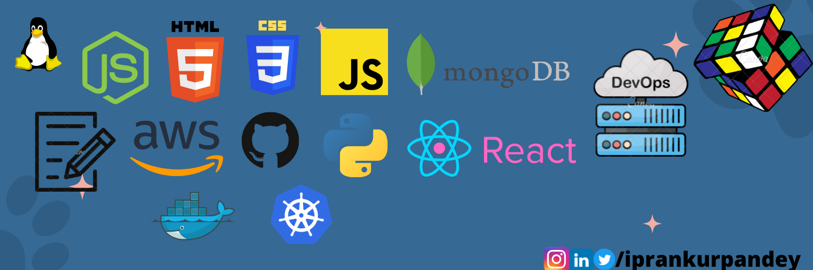

### My Joureny to Full Stack Devlopment(DevOps++)

There is a Roadmap for eveything whether it is cooking or playing ,so does learning to code has too.

The roadmap contains the list and details of technologies which I will be pursuing and will be stick to it

,till I get my dream Job

Here I have divided the all these tech stack in three parts : 🧵

1. Front end

   - HTML ,CSS & JS -> 3 Projects
   - Bootsp with JS -> 2 Projects
   - React Prerequsites
   - React JS -> 5 Projects

2. Back end -> 5 Projects (React Included)

   - Node JS
   - Python

3. DevOps -> 3 Projects

Breaking down things in simple words :

- Linux -Foundation for DevOps
- AWS/Azure - Cloud Technologies
- Git/Github - Version Control System
- Jenkins -CI/CD (Continious Integration/Deployment)
- Containerization - Docker
- Container Orchestration -K8/Kubernetes
- Database -SQL/DynamoDB
- Configration -Ansible/Terraform
- Monitoring - Promethus
- Logging -ELK/Splunk
- Bash scripting
- Programming Language - Python

Before we directly jump exploring these topics there is a strong prerequisites of given things which will make you a better developer.

A better developer is a developer who have strong fundamental knowledge of basics of computer science.

Here is the List of topics which is neccesary and good to have a command over them :

1. OS
2. Computer Networking
3. DSA

Now come to the soft skills part which is must to succeed in th IT world ,no matter in which position you are but soft skills are that one thing which take you way ahead than others.

The skills are given below :

1. Writing
2. Reading
3. Speaking
4. Analytical Mind
5. Open Attitude to learn new things
6. Basic Aptitude
